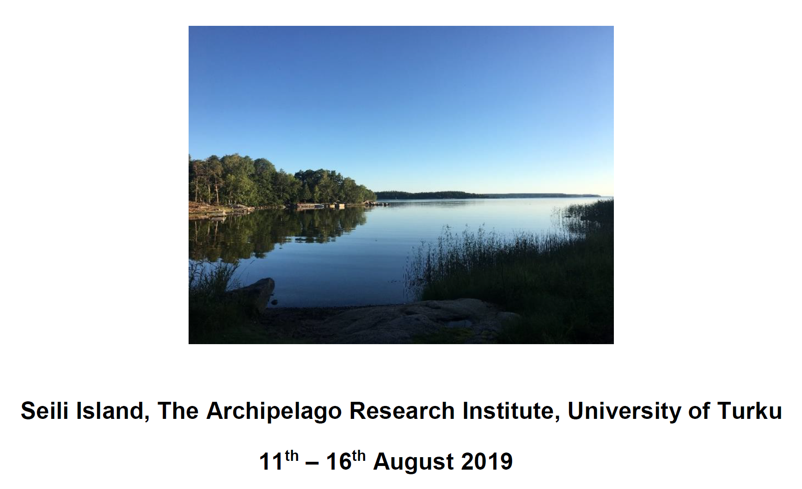

# NordBioMedNet Summer School 2019 in Computational Biomedicine - Imaging, machine learning and precision medicine

 
**Seili**: [Map](https://www.visitseili.fi/en/map) - [Webcam](https://www.visitseili.fi/en/webcam-and-weather/#pll_switcher) - [History](https://www.visitseili.fi/en/history) - [Nature](https://www.visitseili.fi/en/nature)

`Seili-2019` is part of the "Open Educational Resources in Computational Biomedicine"* (OERCompBiomed) project conducted by the [NordBioMed.org](https://nordbiomed.org/news/summer-school-2019) and funded by [Erasmus+](http://ec.europa.eu/programmes/erasmus-plus/projects/eplus-project-details/#project/bc4e0bdb-aa64-4d5c-a7f2-26d68ec36647).

NordBioMed is a collaborative network in the field of Biomedicine(*) between the Universities of Turku, Eastern Finland (Kuopio), Bergen, Odense and Karolinska Institutet. The network was originally formed in 2013 to strengthen the individual biomedical teaching programs within the component universities and make them internationally more competitive by providing complementary activities from the partner universities. The network supports both student and teacher mobility, organises intensive courses and develops virtual online teaching and an information platform on the [Open edX](https://open.edx.org/) platform, supported by a GitHub repository.
Links that redirects to the study programme pages of each NordBioMed partner universities can be found [here](https://nordbiomed.org).

## Summer School Programme (preliminary)

**Sunday, August 11**

Arrival to Turku by plane, bus or train. NB! If you are planning to fly to Helsinki, reserve at least 3 hours to get to Turku by bus from the airport.

 - At 17.45	Get together in Turku riverside (Östra Strandgatan 66), and boat transportation to Seili island
 - Dinner at Seili
 - Welcome and presentation of the Summer School activities and projects  (Lars-Arne Haldosen, KI Stockholm and Junior Mentors - Peder Lillebostad (UiB, Bergen), Elnfaz Fazeli, Olli Moisio and Maxwell Miner (UTU, Turku))
 - Check in and free time

**Monday, August 12**

07:45-08:30	Breakfast  
08:30-09:15	Why are computational skills needed in biomedicine - relevance to uncovering disease mechanisms and for diagnostics (Arvid Lundervold, UIB, Bergen) 
09:15-10:40	Bioimage informatics and machine learning (Pekka Ruusuvuori, Tampere University) 
10:45-12:10	Prostate cancer - clinical aspects (Pekka Taimen, UTU, Turku) 
12:15-13:15	Lunch 
13:15-14:40	Review of pre-assignments - Jupyter notebooks on tools and data repositories (Arvid Lundervold, Peder Lillebostad and Sahtiesh Kaliyugarasan, UiB, Bergen) 
14:45-18:00	Student work with group project (coffee break 16:30-17:00) 
19:00 -	Evening snack and Sauna

**Tuesday, August 13**

07:45-08:30	Breakfast 
08:30-11:00	Workshop - image data analysis, e.g. using unsupervised classification (see [here](notebooks/2.0-unsupervised-learning.ipynb) and [here](notebooks/brain-mri-unsupervised-classification.ipynb)) to analyse prostate cancer (see [here](notebooks/prostate-mri-unsupervised-classification.ipynb)) (Arvid, Peder and Sathiesh) 
11:00-12:00	Presentation [Seili Archipelago research institute](https://www.utu.fi/en/units/cerut/archipelago-research-institute/Pages/home.aspx), Ilari Sääksjärvi, 
		Biodiversity unit, UTU, Turku and head of research station 
12:00-13:00	Lunch 
13:00-14:25	Prostate cancer – molecular mechanisms (Leena Latonen, UEF Kuopio) 
14:30-15:25	Ethics and genetic screening (with a focus on cancer) (Niklas Juth, KI Stockholm) 
15:30-17:30	Workshop - ethics and genetics screening (16:00-16:30 Coffee break) 
17:30-20:00	Student work with own project 
20:00-20:30	Evening snack

**Wednesday, August 14**

07:45-08:30	Breakfast 
08:30-12:00	Follow up discussions on ethics workshop (Niklas Juth, KI Stockholm; Pasi Kankaanpää, UTU, Turku) 
12:00-13:00	Lunch 
13:00-14:00	Workshop - image data analysis cont. (Arvid Lundervold, Peder 
		Lillebostad and Sathiesh Kaliyugarasan, UiB, Bergen) 
14:00-18:00	Student work with group project (Break 16:30-17:00 with snacks) Network meeting 
19:00 -	Evening snack and sauna 

**Thursday, August 15**

07:45-08:30	Breakfast 
08:30-10:25	Deep learning models to recognize tissue types (Bjarne Thorsted, SDU, Odense) 
10:30-12:00	EuroBioimaging (Pasi Kankaanpää, UTU Turku) 
12:00-13:00	Lunch 
13:00-14:25	Career opportunities outside academia - companies in bioimage informatics – Sami Blom, Aiforia, Helsinki 
14:30-15:30	Career opportunities outside academia - companies in bioimage informatics – Juha Rantala, Misvik, Turku 
15:30-18:00	Student work with group project (Coffee break 16:30-17:00)  
19:00-	Summer school dinner 

**Friday, August 16**

07:45-08:30	Breakfast 
08:30-10:30	Student presentations with feedback  
10:30-10:45	Coffee break 
10:45-12:00	Student presentations with feedback  
12:00-12:30	Check out and transport to boat 
Around 13.00 Departure to Turku and light lunch on board 
Around 15:00 Arrival to Turku city centre and Goodbye! 

# Setting up your system

**Follow the instructions at [Setting up your system](setup.md) (`setup.md`) to get ready**

Note: To access the course notebooks interactively without downloading any software we are planning to use [Binder](https://mybinder.org), see also
[BinderHub](https://github.com/jupyterhub/binderhub) and [try Jupyter without installing anything](https://jupyter.org/try)

# Notebooks
The course is based on the Jupyter Notebook, a web-based framework for developing and presenting code-based projects (take a look at https://youtu.be/HW29067qVWk and https://youtu.be/2eCHD6f_phE for introductions to Jupyter Notebooks, and A. Rule et al. _Ten simple rules for writing and sharing computational analyses in Jupyter Notebooks_. [PLOS Computational Biology, July 25 2019](https://journals.plos.org/ploscompbiol/article?id=10.1371/journal.pcbi.1007007)).

Throughout the course you will work with notebooks that contain various material and programming tasks. We recommend that you *make a copy of our notebooks before you are editing them*. In this respect you might adopt the naming convention `my_[name_of_notebook].ipynb`.

# Test your environment and Get started
**BEFORE** the Summer School:
* [Python, Numpy, Pandas, Matplotlib, Nibabel, Biopython and more](notebooks/0.0-test.ipynb): run through this notebook (`notebooks/0.0-test.ipynb`) to check that your environment is OK. 

* Go through the basic notebooks (*make a copy of our notebooks before you are editing them*):
  * [1.0-python-basics](notebooks/1.0-python-basics.ipynb) for intro to **Python**
  * [1.1-numpy-basics](notebooks/1.1-numpy-basics.ipynb) for intro to **NumPy**
  * [1.2-pandas-basics](notebooks/1.2-pandas-basics.ipynb) for intro to **Pandas** and **Matplotlib** / **Seaborn**
  * [1.3-scikit-learn-basics](notebooks/1.3-scikit-learn-basics.ipynb) for intro to **scikit-learn**
  * [1.5a-keras-basics-mnist](notebooks/1.5a-keras-basics-mnist.ipynb) for intro to deep learning and **Keras** using the MNIST data and `tf.keras`
  * [1.5b-keras-basics-fashion-mnist](notebooks/1.5b-keras-basics-fashion-mnist.ipynb) for intro to deep learning using Fashion-MNIST data, `tf.keras`, and `TensorBoard`
  * [1st_notebook_Network_graphs_students.ipynb](notebooks/1st_notebook_Network_graphs_students.ipynb) for intro to networks/graphs
  * [2nd_notebook_Insulin_ego_protein_network.ipynb](notebooks/2nd_notebook_Insulin_ego_protein_network.ipynb) for intro to protein-protein  interaction networks
  * [2.0-unsupervised-learning.ipynb](notebooks/2.0-unsupervised-learning.ipynb) for introduction to clustering

__________________________________________________________________________ 

SPONSORS 

